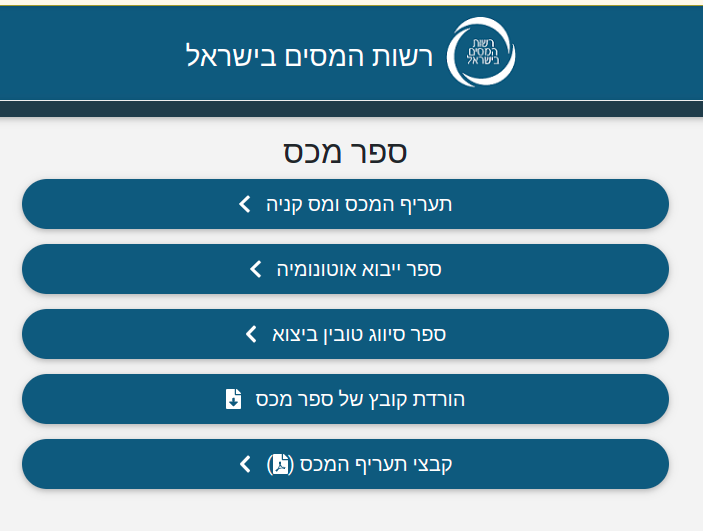

#  מערכת שער עולמי

##  קבצי מידע אשר ניתנים להורדה מאתר האינטרנט

קבצי המידע ניתנים להורדה מכאן:

https://shaarolami-query.customs.mof.gov.il/CustomspilotWeb/he/CustomsBook/

לחץ על "הורדת קובץ של ספר המכס" כדי להוריד אליך קובץ ZIP
(בגודל 120 MB) .

### מבנה הקובץ

קובץ הZIP מכיל קבצי XML אשר מכילים את כל המידע המוצג ע"י מערכת שער עולמי. 

בנוסף, קובץ ה ZIP מכיל קובץ accdb שהוא קובץ database של תוכנת Microsoft Access .

לצורך עיבוד המידע, המרנו את קובץ הaccdb לdatabase של MySQL. תהליך ההמרה מתואר בפירוט כאן:

[Converting Access DB](https://github.com/evyatark/Customs_Book/tree/master/AccessDB)
