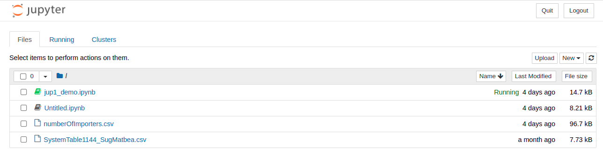
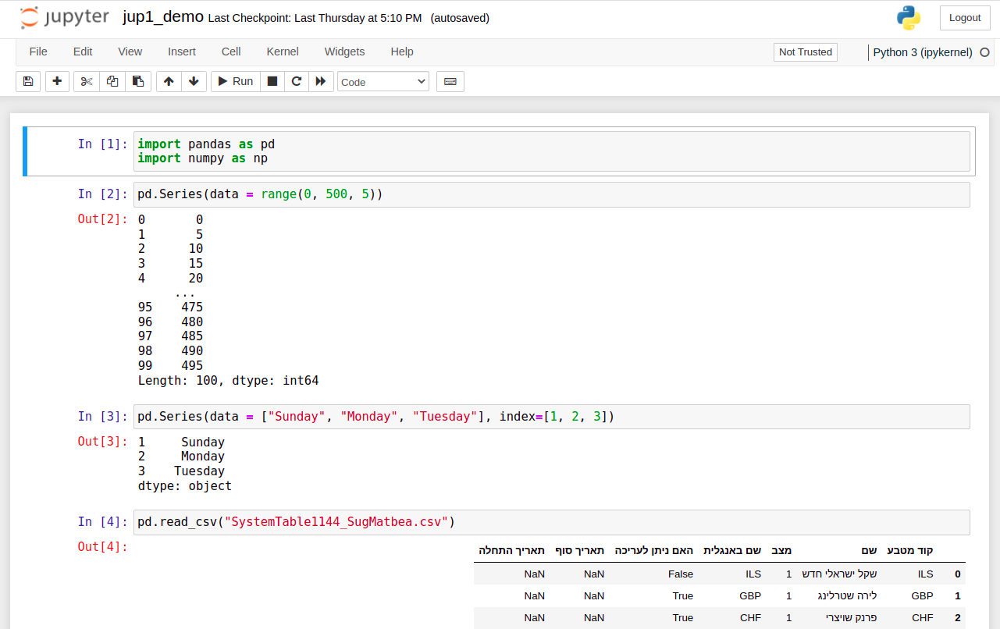

# Customs_Book
ספר היבוא והמכס

# Working with Jupyter

## Preparing
1. On a fresh subdirectory, create a virtual env and activate it
```
cd ~/work/python
mkdir jupyter1
cd jupyter1/
pyenv virtualenv jupyter1
pyenv activate jupyter1 
```
2. Install Jupyter and Pandas
```
pip3 install jupyter
pip3 install pandas
```
3. Run Jupyter
```
jupyter notebook
```
4. (If not opened automatically) open a web browser and navigate to
http://localhost:8888/tree




5. Click the notebook (`ipynb` file) you wish to work on.
The notebook looks like this:



```

```

## Useful stuff for working inside a Jupyter notebook
Press 'ESC' key to switch to "command mode"

Then move between cells with UP and DOWN arrows.

When on a specific cell, press ENTER to start editing in that cell.

To delete a cell, press `d` twice (like in vi editor!)

CTRL+ENTER executes the curren cell. SHIFT+ENTER executes the current cell and moves to the next cell.

In command mode, press Y to change current cell to `Code`, press M to change to `Markdown`


## Working with Pandas
see [this](./Pandas_Documentation.md) document.

