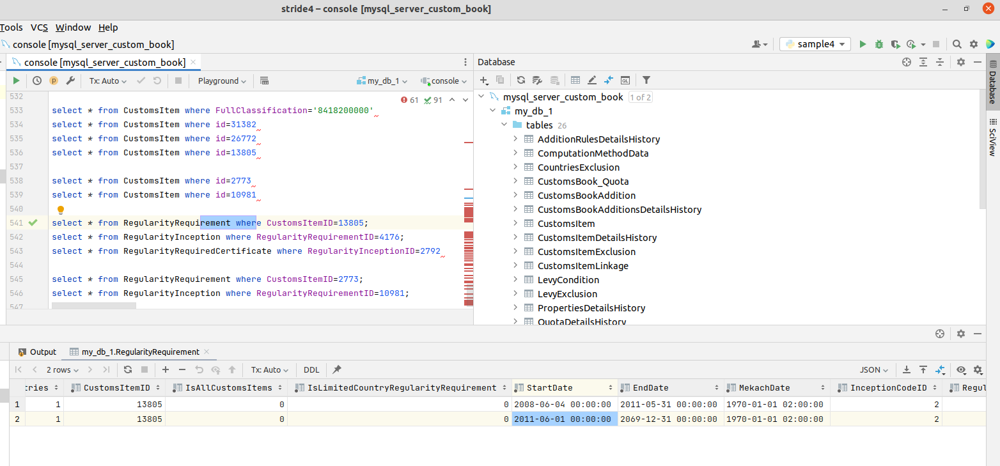

# Customs_Book
# ספר היבוא והמכס

This python script reads an SQL database
(The database was downloaded from ShaarOlami web-site as an AccessDB file and converted to a MySQL database.)
This code emulates the ShaarOlami web-site backend - it reads data from the database that is needed to create (on-the-fly) the web page.

The logic of reading is a based on reverse engineering the web-site - it is not certain that this is how Shaar-Olami is working!

# Working with Python, mysql connector, Pandas

## Preparing
create a virtual env (only the first time) and activate it

```
# cd to root of git repo
cd /home/evyatar/Documents/custom/GitHub/Customs_Book
# cd to working dir
cd ReadDB
# only in the first time to create env
pyenv virtualenv readdb1
# each time - activate virtual env
pyenv activate readdb1

# only once (in the first time) for this virtual env
pip3 install mysql-connector-python
pip3 install pandas
```

## Creating and populating a a MySQL database
This is done in a different project! (see ../AccessDB)
The code in this project assumes that a **populated** MySQL database already exists!

## MySQL
This project uses MySQL database for several reasons. In theory you could use another SQL database (such as PostgreSQL).
But some of the stuff here works **only** with MySQL (for example, the dump.sql file used to populate the database uses a MySQL dialect)

## Starting a MySQL database
I use `docker` to start a MySQL database on my local machine.
This is the most convenient way. But you do need to know a bit of docker to use it.

The database was populated from a dump.sql file (this was a **one time** operation, using a command such as
```
docker run -v $(pwd)/my_data:/data --link mysql_server_custom_book:mysql --rm   sami/mysql-client   mysql --host=mysql --user=evyatar_user --password=123456 --database=my_db_1 --execute='source /data/dump.sql'
```
see ../AccessDB project)

Now, whenever you wish to work with the database, do one of the following:
1. check if a docker database container is already up. If it is, no further action is needed
```
(readdb1) evyatar@dell-precision-3551:~/Documents/custom/GitHub/Customs_Book/ReadDB$ docker ps
CONTAINER ID   IMAGE     COMMAND                  CREATED       STATUS        PORTS                                                  NAMES
03fef32f6229   mysql:5   "docker-entrypoint.s…"   8 weeks ago   Up 20 hours   0.0.0.0:3306->3306/tcp, :::3306->3306/tcp, 33060/tcp   mysql_server_custom_book
```
2. if a docker image of the populated database already exists, 
``` 
(readdb1) evyatar@dell-precision-3551:~/Documents/custom/GitHub/Customs_Book/ReadDB$ docker ps -a
CONTAINER ID   IMAGE          COMMAND                  CREATED         STATUS                       PORTS     NAMES
03fef32f6229   mysql:5        "docker-entrypoint.s…"   8 weeks ago     Exited (0) 2 seconds ago               mysql_server_custom_book
```
just start a container with
```
docker start /mysql_server_custom_book
```
(later you may use `docker start /mysql_server_custom_book` to stop the container)

3. if a docker image does not exist, you will need to create it (once) with
```
docker run --detach --name=mysql_server_custom_book --env="MYSQL_ROOT_PASSWORD=123456" --env="MYSQL_USER=evyatar_user" --env="MYSQL_PASSWORD=123456" --env="MYSQL_DATABASE=my_db_1"  --volume=/home/evyatar/Documents/custom/GitHub/Customs_Book/MySQL/mysql_server/server/conf.d:/etc/mysql/conf.d --publish 3306:3306 mysql:5
```
and populate it (once) with another docker command that starts a MySQL client (not a server) and imports a dump.sql file into the database server.
Note that the credentials of the client should match the server, and that the dump.sql file must already exist!
```
docker run -v $(pwd)/my_data:/data --link mysql_server_custom_book:mysql --rm   sami/mysql-client   mysql --host=mysql --user=evyatar_user --password=123456 --database=my_db_1 --execute='source /data/dump.sql'
```

### Docker
docker works very well on Linux operating systems (such as Ubuntu etc. My personal laptop has Ubuntu, not Windows(!), and it works great!).

docker works well on Mac computers (with some minor difficulties).

docker can work on Windows machine, but there may be some issues. It is improving over the years.

There are some docker alternatives that may become even more convenient (such as `podman` or even `kubernetes`) in the future.

### non-docker database
There are other ways to start (or have) a database you can work with. Some of them are:

1. Have a database running on another machine, possibly in the cloud. Someone else may have started this database for you. In that case, all you need are the credentials
   (URL - the "address" of the database server, Credentials - the username and password)
2. Install a MySQL database on your local machine (or on any other computer, possibly in the cloud). This was the usual way until `docker` arrived.
The disadvantage is that your computer now has a database server, which is an application that runs all the time and uses resources. In addition, it is
difficult (but possible) to use different databases for different purposes.

## Connecting to the MySQL database
After a database is up (`docker ps` shows an active docker image, like in #1 above. Or if you used another way to have a database)
You can start a SQL client that connects to the database.

A SQL client is an application that knows how to connect to a database (once you supply the URL and Credentials of the database),
and then enables you to write SQL queries and execute them to retrieve data from the database.
Most such applications also supply convenient ways to query the database even without knowing the SQL language.

I usually use the IntelliJ database pane.

For example, in my PyCharm IDE:



Supplying the connection details (address of the database server, and username+password), is done only once (after that the client app remembers it).

In this example, the address of the database server is `localhost` because the server runs on the same local machine (in a docker container):


## Executing Python script
After editing the file `readDB.py`, run it:

```
python readDB.py
```

## Using Python to read data from a MySQL database
Here are some links which explain how this could be done:

[How to Create and Manipulate SQL Databases with Python](https://www.freecodecamp.org/news/connect-python-with-sql/)

